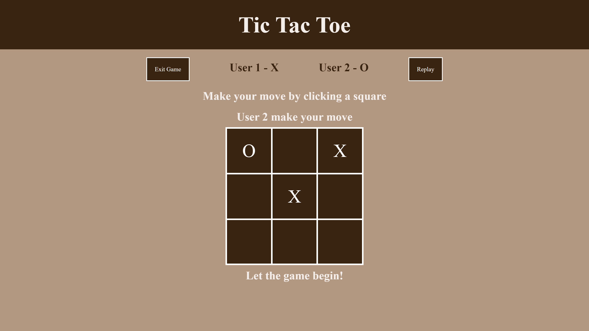
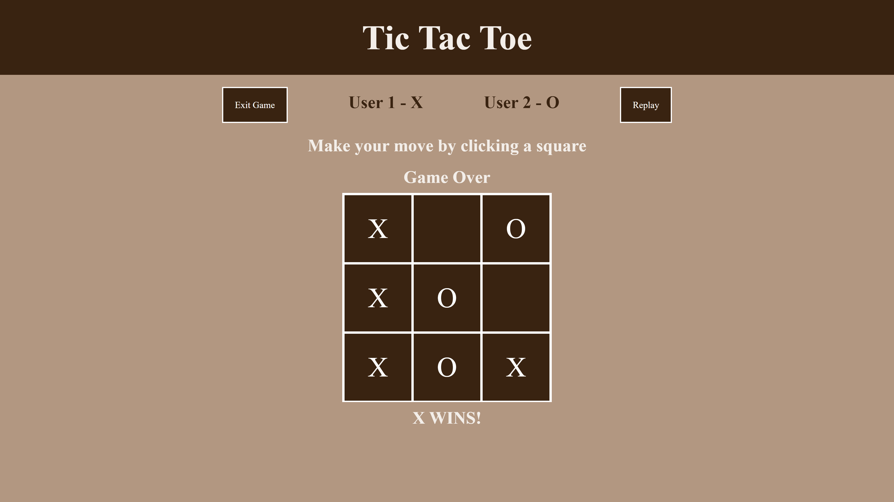
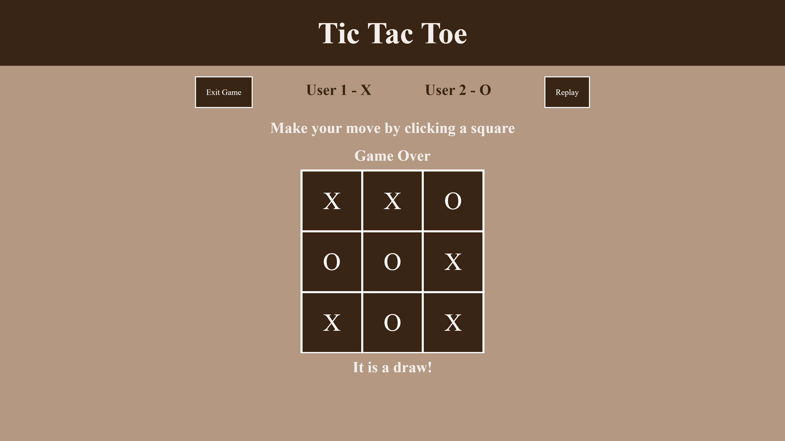

# Tic Tac Toe
## This is a visual multi-player JavaScript tic-tac-toe game which can be played on the browser.

This is the image of the gameboard. 

The line above the grid indicates which user must make the next move. 

The game is over. O wins! 

The game is over. X wins! 

The game is over. It is a draw.
